# Local Motion Phases

This repository provides skeleton code for the paper [Real-Time Style Modelling of Human Locomotion via
Feature-Wise Transformations and Local Motion Phases](https://arxiv.org/abs/2201.04439).

Two Unity demos are provided, one showing the data labelling process and another showing the animation results. Additionally python code for training a neural network using local motion phases is given.

This code is meant as a starting point for those looking to go deeply into animation with neural networks. The code herein is uncleaned and somewhat untested. This repo is not actively supported. It is strongly encouraged to consider using the much more active repository [AI4Animation](https://github.com/sebastianstarke/AI4Animation), the work on [DeepPhase](https://dl.acm.org/doi/10.1145/3528223.3530178) supersedes this work achieving better results with a more general solution.

## Data

This code works with the 100STYLE dataset. More information about the dataset can be found [here](https://www.ianxmason.com/100style/). Processed data labelled with local phases can be found [here](https://zenodo.org/record/8127870).

## Demo 1: Data-Labelling

This demo gives an example for importing, labelling and exporting the bvh for the swimming style (forwards walking).

### General Comments

- The demos require [Unity](https://unity.com/). The version used was 2018.4.19f1.
- You may experience issues with Eigen. Is so try navigating to Plugins/Eigen copy the command in ```Command``` and run it.
- I couldn't figure out how to get the demo working on mac and it is untested on windows. It should work on linux.

### To import the bvh

  1. Open the Unity project.

  2. Select Data Processing > BVHImporter 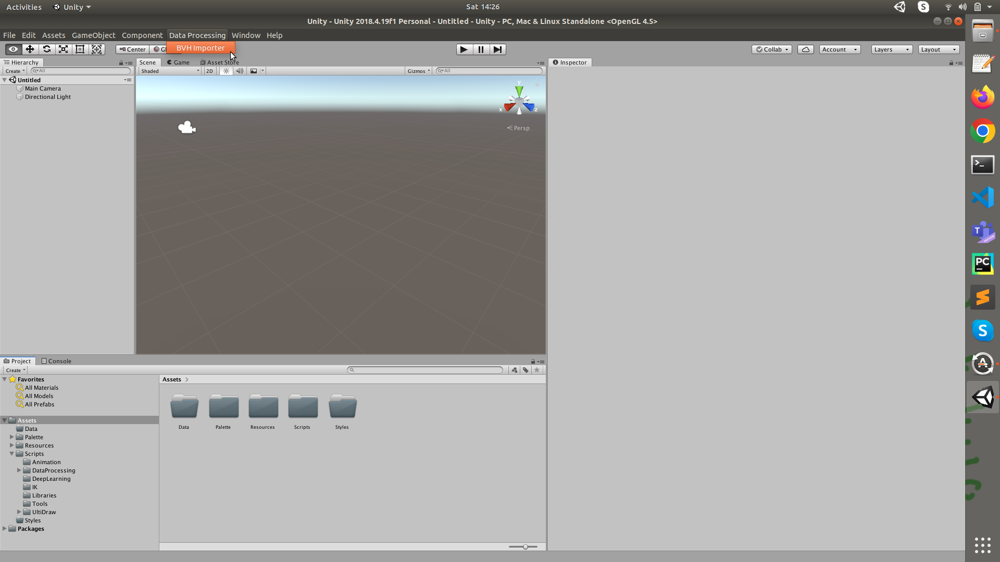

  3. Set the Source to ```Assets/Data``` and the destination to ```Assets/Styles/Swimming```. (These paths can be changed for custom data.)

  4. Hit load single directory and click enable all. You should see the file ```Swimming_FW.bvh``` in green.

  5. Click Import Motion Data 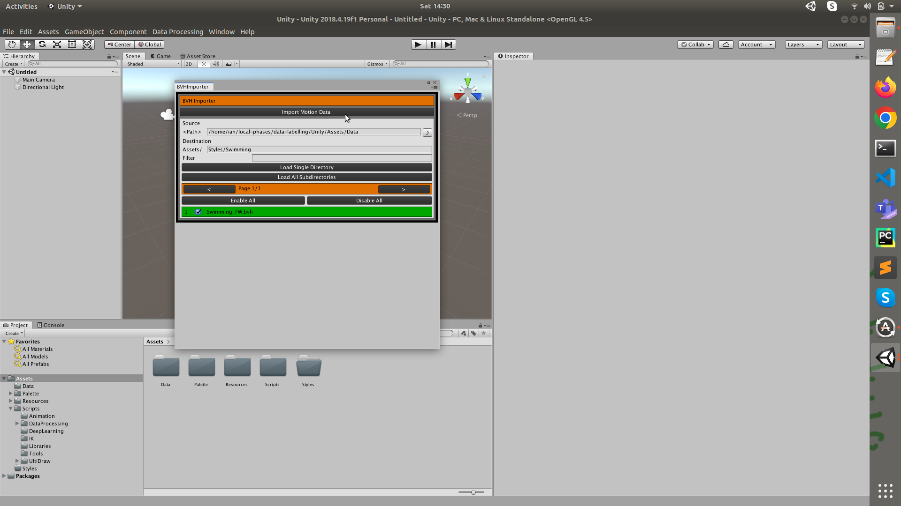

  6. Wait for data to import. You should then see ```Swimming_FW.bvh.asset``` in ```Assets/Styles/Swimming```.

### To label the data

  1. In ```Assets/Styles/Swimming``` open the scene StyleData 84. (If materials and textures are missing for the walls and floor drag and drop from the resources directory. I.e. drag the grey material onto the inspector for the walls and the checkerboard texture onto the plane.)

  2. For the ground plane in the inspector add a new layer called "Ground" if it is not present (otherwise the trajectory will not project onto the ground). 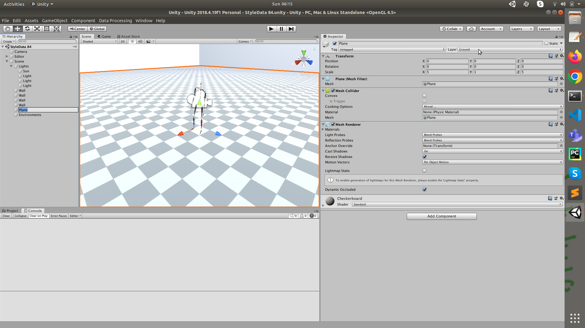

  3. Select the editor and add the component ```Motion Editor``` using the inspector if it is not present.

  4. Set the folder to ```Assets/Styles/Swimming``` and click Import (you can import more than one swimming bvh to this directory and files will appear as a drop down in the ```data``` field.)

  5. Set the semi-automatic processing path to ```Assets/Data/Dataset_List.csv``` 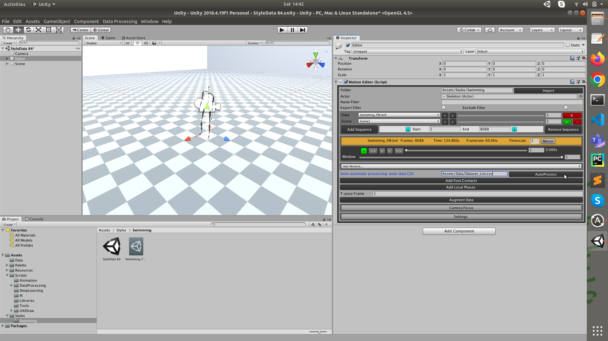

  6. Click AutoProcess. Wait for the auto labelling to complete (around 15 seconds). This should add the Trajectory Module, Phase Module, Gait Module and Style Module.

  7. Next press Add Foot Contacts. The default settings should be okay, or you can play around to see if there are better settings. Green bars represent detected foot contacts.

  8. Finally press Add Local phases. This labels local phases using contacts where available and a PCA-heuristic method where not (as described in the paper). Wait for the phase fitting progress bar to get to end. 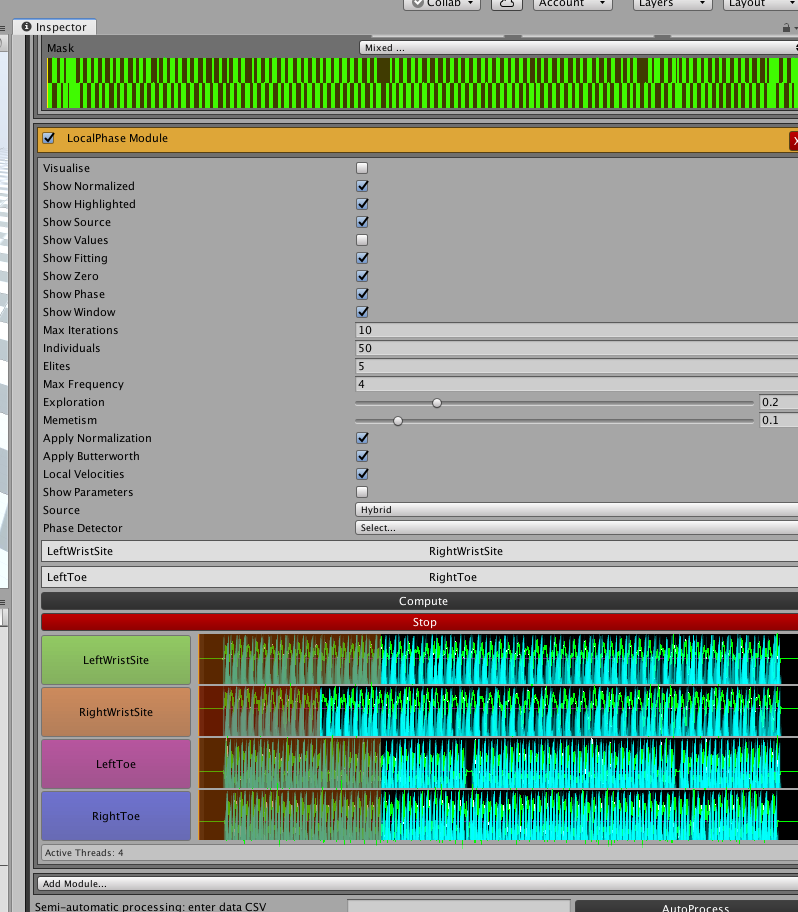

### To export the data

  1. In settings at the bottom of the Motion Editor, tick the export button.

  2. Data Processing > MotionExporter and Data Processing > MotionClipExporter export in/out frame pairs or multi-frame clips of motion respectively. Select Data Processing > MotionExporter.

  3. Set the export directory to the location that you want to export labelled data to.

  4. Scroll to bottom and select Export Data From Subdirectories. The data will begin exporting. 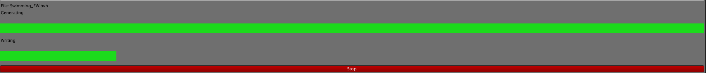

  5. This exports txt files which can be processed further for neural network training. The txts from doing this labelling process for all styles in 100STYLE can now be found [here](https://zenodo.org/record/8127870).

## Demo 2: Animation-Demo

This demo shows some results after training a neural network with data labelled with the process described above.

### To run the demo

  1. Open the Unity project.

  2. Open the demo scence at Demo/Style_Demo_25B. As with the data labelling demo, if textures and materials are not showing correctly add the textures to the walls and the ground. Additionally add the Y Bot joints and body textures.

  3. Add a new layer called "Ground" for the ground plane (as in the data labelling pipeline above).

  4. Add any missing scripts to the camera. The scripts on the camera should include ```post-processing behvior``` , ```camera controller``` and ```fps```, configured as shown below.  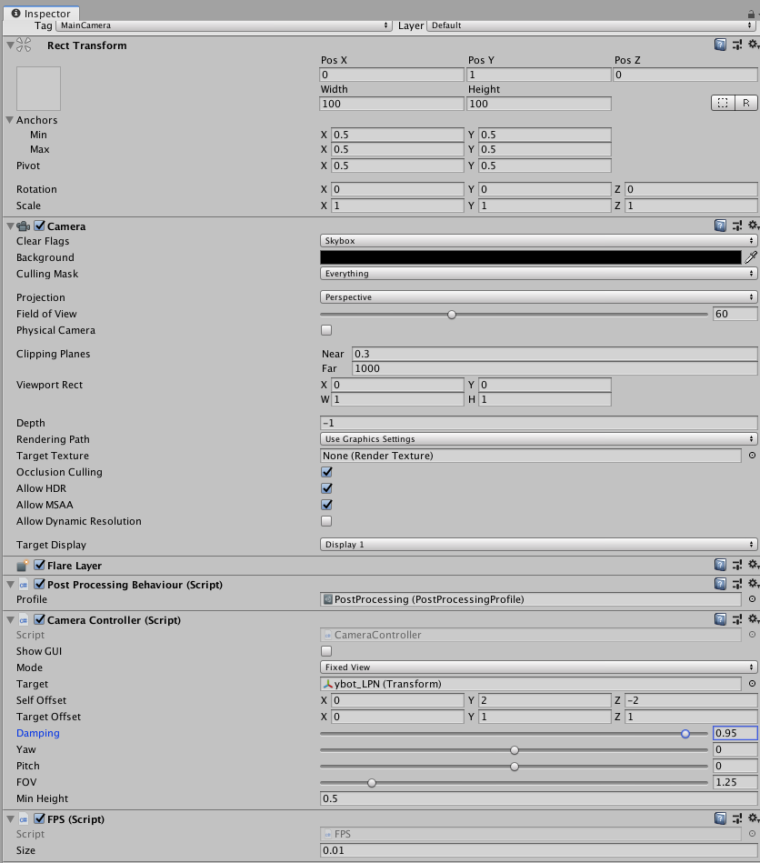

  5. Add any missing scripts to ybot_lpn. The scripts on the character should include ```actor```, ```input handler```, ```bio animation```, and ```lpn_film```.

  6. In the ```actor``` script turn off unneeded bones 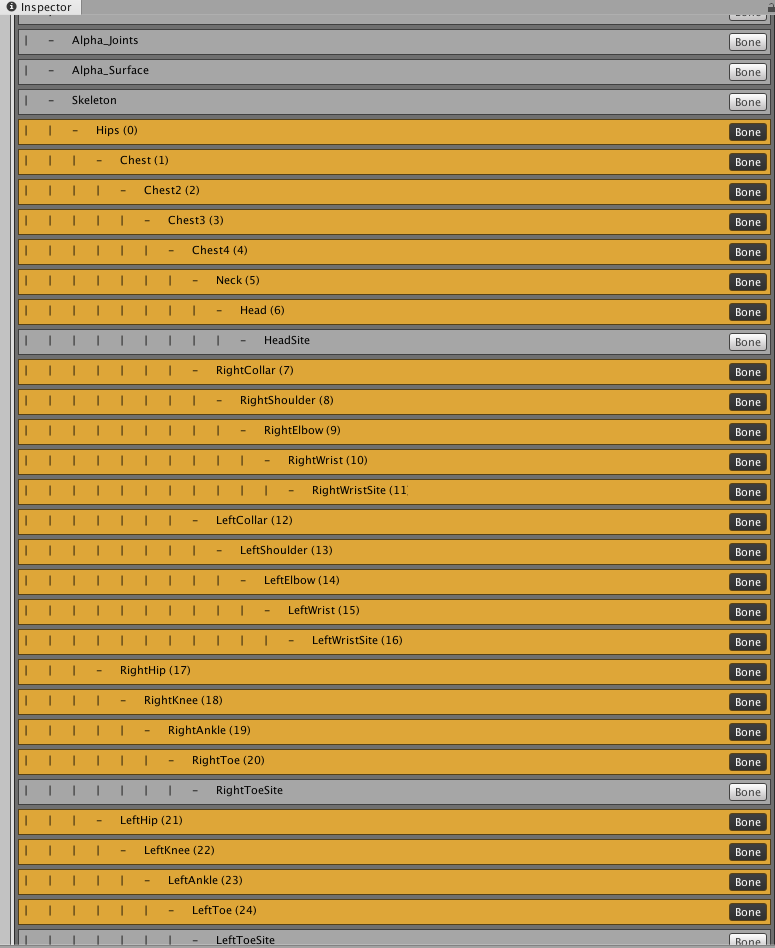

  7. Configure the ```bio animation``` script as shown 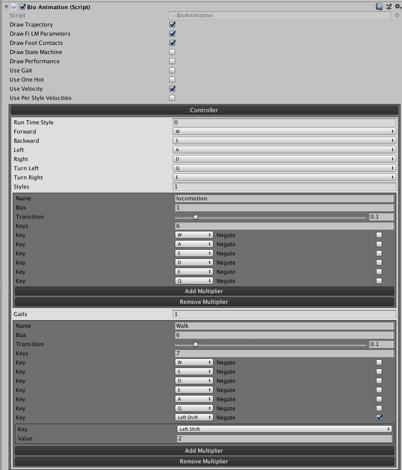

  8. Configure the ```lpn_film``` script as shown and click Store Parameters 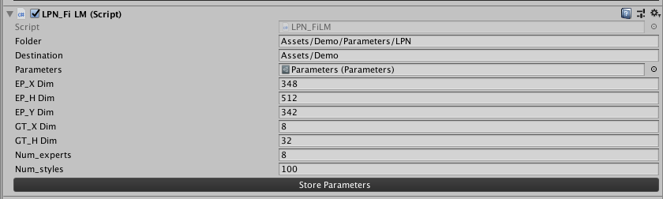

  9. Press the play button and the demo should run. If you build into a standalone executable the demo will run much faster (File > Build Settings). You can change the style of motion and interpolate between styles in the bottom left. The character is controlled with WASDEQ and left shift.

### Notes on the demo

- The network parameters were found on an old server, the results mostly seems reasonable but style 23 seems to have some error.
- Style 57 is a good example of a motion that would be difficult for methods that extract phases based only on contacts with the ground or objects in the environment.
- Styles 0-94 are used to train both the Gated Experts Network and the FiLM Generator. Styles 95-99 come from finetuning only the FiLM Generator..
- You will get likley be able to achieve more robust and more general results with [DeepPhase](https://dl.acm.org/doi/10.1145/3528223.3530178).

## Network Training

The code uses tensorflow 1.X, numpy and PyYAML are also required. This part of the repo is untested, I have grabbed the files I think are needed but not tried running the code. If there is some missing import (or similar trivial error) let me know and I will look for it.

In file names LPN is short for Local Phase Network and refers to the main system in the paper 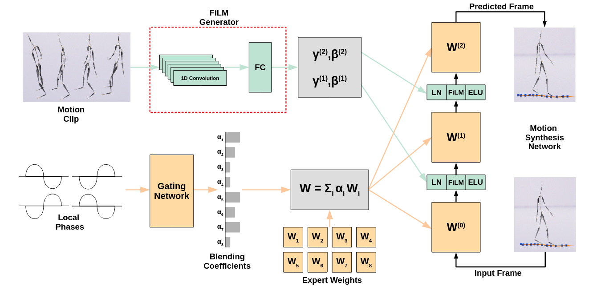

### Data processing

  1. The training uses the tfrecords file format.

  2. Labelled data in txts is found [here](https://zenodo.org/record/8127870). To convert to tfrecords run ```frame_tfrecords_noidle.py``` and ```clip_tfrecords_noidle.py``` to get tfrecords for frames and clips of motion.

  3. Run ```Normalize_Data_Subset.py``` to get input and output normalization statistics.

### Training

  1. The system is trained by running ```LPN_100Style25B_BLL_Train.py```. This uses the config file ```LPN_100Style25B_BLL.yml```. You will need to set ```data_path``` and ```stats_path``` to point to extracted tfrecords and normalization statistics directories. Also ```save_path``` for where you want to save the model. If finetuning also set ```ft_model_path```.

  2. After training, ```LPN_Finetuning_Weights.py``` saves the gating network and expert weights as binaries for use with Unity.

  3. ```LPN_FiLM_Parameters.py``` saves the FiLM parameters as binaries for use with Unity.

  4. ```LPN_get_unity_mean_std.py``` saves normalization statistics for use with Unity.

  5. (Optional) ```LPN_test_error.py``` calculates quantitvate test error

  6. (Optional) ```LPN_FiLM_Finetuning.py``` finetunes only the FiLM generator on a new style. This uses ```LPN_FiLM_Finetuning.yml```, where you will need to set the paths to point to your directories.

## Citation & Licensing

### Citation

If you use this code or data in your research please cite the following:

```
@article{mason2022local,
    author = {Mason, Ian and Starke, Sebastian and Komura, Taku},
    title = {Real-Time Style Modelling of Human Locomotion via Feature-Wise Transformations and Local Motion Phases},
    year = {2022},
    publisher = {Association for Computing Machinery},
    address = {New York, NY, USA},
    volume = {5},
    number = {1},
    doi = {10.1145/3522618},
    journal = {Proceedings of the ACM on Computer Graphics and Interactive Techniques},
    month = {may},
    articleno = {6}
} 
```

### Licensing

The 100STYLE dataset is released under a [Creative Commons Attribution 4.0 International License](https://creativecommons.org/licenses/by/4.0/).

Large parts of the code inherit from [AI4Animation](https://github.com/sebastianstarke/AI4Animation) which comes with the following restriction: ```This project is only for research or education purposes, and not freely available for commercial use or redistribution.```

The Y Bot character in the demos comes from [Adobe mixamo](https://www.mixamo.com/). At the time of publication the following applies:

```
Mixamo is available free for anyone with an Adobe ID and does not require a subscription to Creative Cloud.

The following restrictions apply:

    Mixamo is not available for Enterprise and Federated IDs.
    Mixamo is not available for users who have a country code from China. The current release of Creative Cloud in China does not include web services.
```
